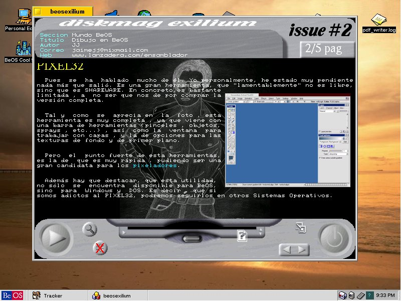
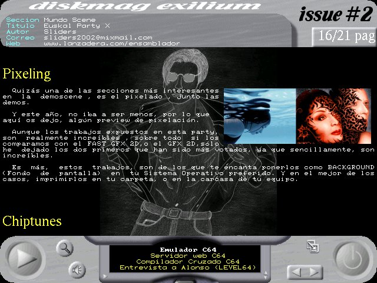
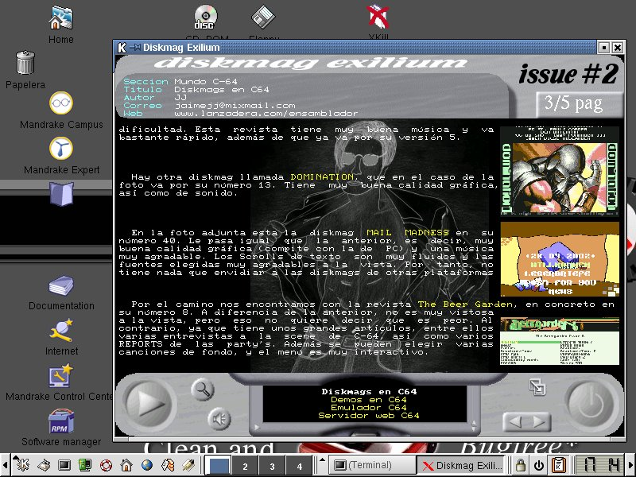
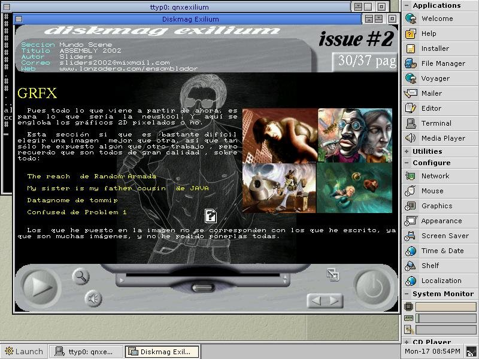
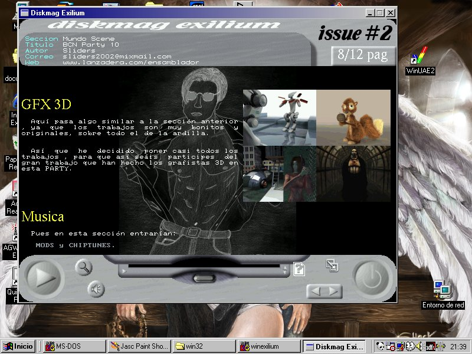

# Diskmag Exilium 2 (February 2003)

Around February 2003, our <b>Sliders</b> group published issue 2 of the Diskmag Exilium on our own FTP. 
Subsequently, several members of the demoscene published it on <b>pouet.net</b> and <b>scene.org</b>.

<ul>
 <li><a href='https://www.pouet.net/prod.php?which=8803'>https://www.pouet.net/prod.php?which=8803</a></li>
 <li><a href='https://files.scene.org/view/mirrors/scenesp.org/diskmags/exiliumwin32-2.zip'>https://files.scene.org/view/mirrors/scenesp.org/diskmags/exiliumwin32-2.zip</a></li>
</ul>  

The diskmag was cross-platform (DOS, Windows, Linux, Beos and QNX). It had several other engines, such as BSD and PSX, but in the end, it came out for those 5.
The editor and coder of it is me (JJ, ackerman). 

After so many years, I am releasing the code, so that it can be looked at in an educational way or whatever you want, given that it is of little use today.  

If you only want to run, the data (sliders2.dat) was in the MSDOS distribution, having to copy the binaries for each OS to the same location.
